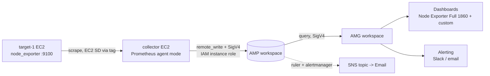

# AWS AMP + AMG Monitoring Lab

Hands-on lab: monitoring EC2 instances with **Amazon Managed Service for Prometheus (AMP) and Amazon Managed Grafana (AMG)**, using `node_exporter` and a **Prometheus agent-mode collector** with EC2 service discovery, SigV4 remote write, dashboards and alerting.

> This is a personal practice lab (not a client project). The most valuable part is the [troubleshooting log](troubleshooting/issues-and-fixes.md) - real problems I hit and how I fixed them.

## Architecture

## What this lab covers
- Two EC2 instances: a **target** (node_exporter) and a **collector** (Prometheus agent)
- Dynamic target discovery with `ec2_sd_configs` and the tag `Monitoring=enabled`
- IAM instance role + **SigV4** authenticated `remote_write` to AMP
- AMG workspace with IAM Identity Center login and AMP data source
- Dashboards: imported (ID 1860) and a custom one with a variable
- Alerting: Grafana-managed (Slack) and AMP-managed rules (SNS email)
- Cost control and cleanup

## Tech used
AWS (EC2, IAM, AMP, AMG, IAM Identity Center, SNS, CloudWatch) - Prometheus, node_exporter, Grafana, PromQL, systemd, awscurl

## Setup guide (in order)
1. [EC2 instances, security groups, node_exporter](setup/01-ec2-and-node-exporter.md)
2. [AMP workspace, IAM role](setup/02-amp-workspace-and-iam.md)
3. [Prometheus agent + remote_write, verification](setup/03-prometheus-agent-remote-write.md)
4. [AMG workspace, Identity Center, data source](setup/04-amg-and-datasource.md)
5. [Dashboards and alerting](setup/05-dashboards-and-alerting.md)
6. [Cleanup](setup/06-cleanup.md)

Config files are in [`configs/`](configs/). Replace all `<PLACEHOLDERS>` with your own values.

## Two ways to collect metrics into AMP

| | Method 1: Prometheus agent mode (used here) | Method 2: ADOT Collector |
|---|---|---|
| Tool | Native Prometheus binary (`--agent`) | AWS Distro for OpenTelemetry |
| Target discovery | Dynamic (`ec2_sd_configs` + tags) | Static IPs in config |
| SigV4 | Built into `remote_write` (`sigv4:` block) | `sigv4auth` extension |
| Config | `prometheus.yml` (familiar) | `config.yaml` (receivers/processors/exporters) |
| Caution | Needs `ec2:DescribeInstances` | Static IPs break when instances are replaced |

I used Method 1 because it keeps the familiar Prometheus config and gives auto-discovery.

## Open-source Prometheus/Grafana vs AMP/AMG - key differences I learned
- **Push, not pull**: AMP does not scrape. The agent pushes with `remote_write`.
- **SigV4 + IAM**: no username/password. Requests are signed with the IAM role (IAM = permission, SigV4 = proof of identity).
- **No Prometheus UI on AMP**: use Grafana Explore or `awscurl` against the *query* endpoint.
- **Grafana login** is via IAM Identity Center, and the user must be assigned **Admin** to add data sources.
- **No file provisioning**: keep dashboards as JSON in Git and import/deploy via API or Terraform.

## Key learnings
- Remote write URL (`.../api/v1/remote_write`) is write-only; queries use `.../api/v1/query`.
- Region must match everywhere: workspace, `sigv4.region`, and the endpoint URL.
- Agent mode has no local TSDB or query API, so verify with `/metrics` counters and by querying AMP itself.
- 30s scrape interval instead of 15s roughly halves ingestion cost.

## Security note
No credentials, account IDs, workspace IDs or webhook URLs are committed. Use placeholders and IAM roles, never access keys.
