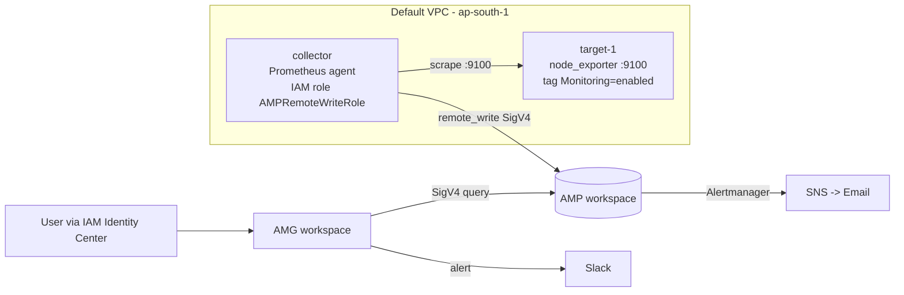

# Architecture

## Data flow
1. `node_exporter` exposes host metrics on port 9100 of the target.
2. The collector discovers targets through the EC2 API (tag filter) and scrapes them every 30s.
3. Samples are pushed to AMP with SigV4-signed `remote_write`, using the collector's instance role.
4. AMG reads from AMP using its service-managed role; users sign in through IAM Identity Center.

## Security groups
| SG | Inbound |
|---|---|
| target-sg | TCP 9100 from collector-sg; SSH 22 from my IP |
| collector-sg | SSH 22 from my IP only (agent mode has no UI, 9090 stays closed) |
